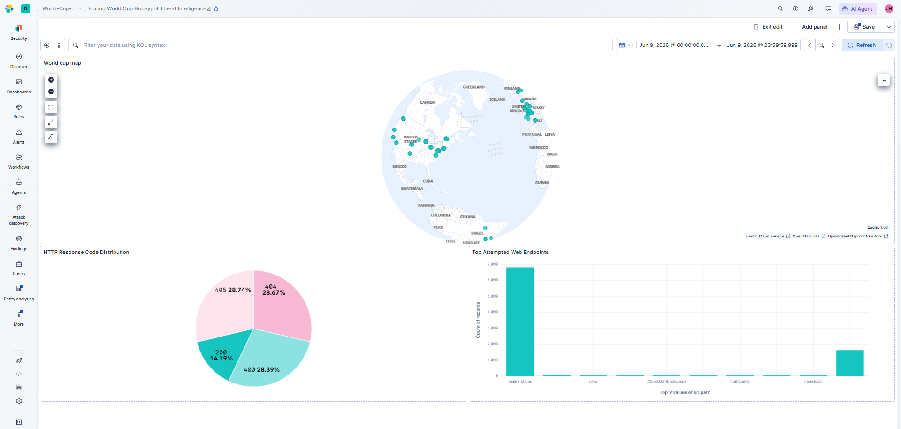

# 🏆 Cloud-Native Global Threat Intelligence Honeypot (FIFA World Cup 2026 Theme)

## 📌 Project Overview
Designed, deployed, and monitored a cloud-hosted deception application (honeypot) structured as a high-value internal FIFA Partner Ticket Allocation Hub. By exposing this deceptive application to the public internet, I captured, aggregated, and analyzed live cyber attack vectors, automated web scanners, and malicious traffic from global threat actors using an enterprise-grade SIEM pipeline.

---

## 🗺️ Live Threat Intelligence Dashboard
*Below is a real-time snapshot of malicious traffic targeting the honeypot infrastructure:*

---

## 🛠️ Technology Stack & Architecture
* **Cloud Infrastructure:** Amazon Web Services (AWS) EC2 (Ubuntu 22.04 LTS), Security Groups (Firewalling)
* **Deception Layer (Honey-App):** Nginx Web Server, Custom HTML5/CSS3 Responsive Gateway Architecture
* **Log Pipeline & Collection:** Elastic Agent (x86_64 architecture deployment)
* **SIEM Analytics & Control Room:** Elastic Cloud, Kibana Data Visualization (GeoIP Mapping, Lens Analytics)

---

## 📊 Phase-by-Phase Implementation

### Phase 1: Cloud Infrastructure Hardening
* Provisioned a Linux virtual machine in AWS EC2. 
* Configured AWS Security Groups using the principle of least privilege, locking down administrative SSH access (Port 22) exclusively to my local machine's IP, while globally exposing HTTP (Port 80) to invite threat traffic.

### Phase 2: High-Fidelity Deception Deployment
* Compiled a highly convincing corporate frontend mimicking an internal FIFA network resource using an inline-optimized, minified asset architecture designed to deploy flawlessly across low-bandwidth terminal environments.
* Configured Nginx to host the decoy web asset while actively generating continuous logging metrics (`access.log` and `error.log`).

### Phase 3: Telemetry & Ingestion Engineering
* Deployed an Elastic Agent pipeline on the remote Linux host, matching x86_64 kernel constraints.
* Built real-time log parsing rules via Kibana Integrations to cleanly extract IP metrics, HTTP response states, and client request targets.

### Phase 4: SOC Analytics Design
* Developed an interactive SOC Dashboard visualizing metrics critical to security operations:
  * **Interactive GeoIP Map:** Correlates source IP headers to visual geographic telemetry to locate threat actor origins.
  * **Top Attempted Endpoints:** Highlights directory brute-forcing behaviors (e.g., automated scripts looking for `/admin`, `/wp-admin`, or configuration assets).
  * **HTTP Response Code Breakdown:** Audits server status distributions to track successful page deliveries versus forced 404/403 security states.

---

## 🔑 Key Security Insights & Takeaways
* **Automated Internet Noise:** Within hours of exposure, automated botnets and malicious scrapers located the server's public IP address without any active domain marketing, proving the continuous nature of internet-wide scanning.
* **Directory Brute Forcing:** The bar charts clearly highlight that threat actors heavily prioritize weaponized scanning for common CMS administrative portals and root directories.
